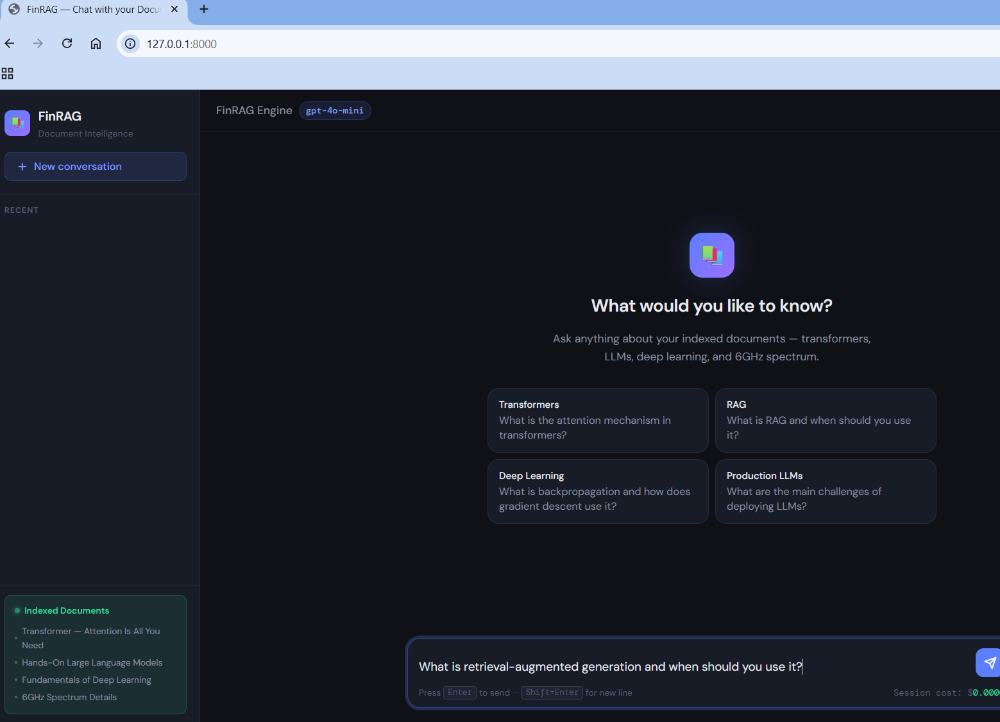

# FinRAG Engine

**Production-grade Retrieval-Augmented Generation (RAG) system** for intelligent question answering over PDF documents. Built with FastAPI, LangChain 0.3+, FAISS, and OpenAI — served through a Claude-style dark chat UI.

---

## What It Does

FinRAG lets you chat with your PDF documents. Drop any PDF into the `data/` folder, run the indexing script, and ask questions in natural language through a browser-based chat interface. The system retrieves the most relevant passages from your documents and uses an LLM to generate a grounded, sourced answer.

---

## Live Demo

```
http://127.0.0.1:8000
```

After starting the server, open the URL above to access the chat UI. Each answer shows which PDF pages were used as sources.

---

## UI Screenshot



*FinRAG Engine — Claude-style dark chat interface with sidebar, suggestion cards, and indexed document panel.*

## Architecture

```
PDF files (data/)
      │
      ▼
src/ingestion.py        — PyPDFLoader reads each PDF page into Documents
      │
      ▼
src/chunking.py         — RecursiveCharacterTextSplitter (800 chars, 150 overlap)
      │
      ▼
src/embeddings.py       — OpenAI text-embedding-3-small → FAISS index
      │
      ▼
vector_store/           — FAISS index saved to disk (index.faiss + index.pkl)
      │
      ▼
src/retriever.py        — MultiQueryRetriever (k=8, LLM decomposes compound questions)
      │
      ▼
src/generator.py        — create_retrieval_chain + gpt-4o-mini → grounded answer
      │
      ▼
app/routes.py           — POST /api/ask  →  {"answer": ..., "sources": [...]}
      │
      ▼
static/index.html       — Claude-style dark chat UI in the browser
```

---

## Repository Structure

```
finrag-engine/
│
├── app/
│   ├── main.py             # FastAPI app factory — mounts routes + static UI
│   └── routes.py           # POST /api/ask endpoint + pipeline singleton
│
├── src/
│   ├── ingestion.py        # PDF loading via PyPDFLoader
│   ├── chunking.py         # Document chunking (800 chars / 150 overlap)
│   ├── embeddings.py       # OpenAI embeddings + FAISS vector store
│   ├── retriever.py        # MultiQueryRetriever (k=8) for compound questions
│   ├── generator.py        # LLM QA chain (create_retrieval_chain)
│   ├── pipeline.py         # End-to-end pipeline loader (called at startup)
│   └── evaluation.py       # Hit@K and MRR retrieval quality metrics
│
├── static/
│   └── index.html          # Claude-style dark chat UI (vanilla JS, no framework)
│
├── tests/
│   └── test_evaluation.py  # Unit tests for Hit@K and MRR metrics
│
├── scripts/
│   └── build_vector_store.py
│
├── data/                   # Drop your PDF files here (not committed to git)
├── vector_store/           # FAISS index (auto-generated, not committed to git)
│
├── create_index.py         # Run this to build/rebuild the vector store
├── Dockerfile              # Production Docker image (non-root, healthcheck)
├── requirements.txt        # Pinned Python dependencies (Python 3.10)
├── environment.yml         # Conda environment definition
└── .env                    # API keys — never committed (listed in .gitignore)
```

---

## Tech Stack

| Component | Technology |
|-----------|-----------|
| LLM | OpenAI `gpt-4o-mini` |
| Embeddings | OpenAI `text-embedding-3-small` |
| Vector DB | FAISS (local, CPU) |
| Retriever | LangChain `MultiQueryRetriever` (k=8) |
| Chain | LangChain 0.3+ `create_retrieval_chain` |
| API | FastAPI 0.115 + Uvicorn |
| Chat UI | Vanilla HTML/CSS/JS (Claude-style dark theme) |
| PDF Parsing | PyPDF via LangChain `PyPDFLoader` |
| Python | 3.10 |

---

## Setup & Installation

### 1 — Clone the repository

```bash
git clone https://github.com/manishengineertech1582-code/finrag-engine.git
cd finrag-engine
```

### 2 — Create the conda environment

```bash
conda env create -f environment.yml
conda activate finrag
```

Or using pip:

```bash
pip install -r requirements.txt
```

### 3 — Configure environment variables

Create a `.env` file in the project root:

```
OPENAI_API_KEY=sk-your-openai-api-key-here
VECTORSTORE_PATH=vector_store
OPENAI_MODEL=gpt-4o-mini
```

> **Never commit `.env` to git.** It is listed in `.gitignore`.

### 4 — Add your PDF files

Copy your PDF documents into the `data/` folder:

```
data/
├── your-document-1.pdf
├── your-document-2.pdf
└── your-document-3.pdf
```

### 5 — Build the vector store

```bash
python create_index.py
```

This reads all PDFs from `data/`, chunks them, embeds them using `text-embedding-3-small`, and saves the FAISS index to `vector_store/`.

Expected output:
```
INFO - Found 4 PDF file(s).
INFO - Generated 2485 chunks
INFO - Embedding 2485 documents with model 'text-embedding-3-small'...
INFO - Vector store created. 2485 documents indexed.
INFO - Indexing pipeline completed successfully.
```

### 6 — Start the server

```bash
uvicorn app.main:app --reload --host 127.0.0.1 --port 8000
```

### 7 — Open the chat UI

```
http://127.0.0.1:8000
```

---

## API Reference

### POST `/api/ask` — Ask a question

**Request:**
```json
{
  "question": "What is the attention mechanism in transformers?"
}
```

**Response:**
```json
{
  "answer": "The attention mechanism in transformers...",
  "sources": [
    {"source": "data/Transformer-attention-is-all-you-need-Paper.pdf", "page": 6},
    {"source": "data/Hands-On-LLM.pdf", "page": 255}
  ]
}
```

### GET `/health` — Health check

```json
{"status": "ok"}
```

### GET `/docs` — Swagger UI

Interactive API documentation at `http://127.0.0.1:8000/docs`

---

## Chat UI — `static/index.html`

A production-quality, single-file chat interface served directly by FastAPI at `http://127.0.0.1:8000`. Built with vanilla HTML, CSS, and JavaScript — no React, no framework, no build step required.

### Design

| Property | Value |
|----------|-------|
| Theme | Dark navy (`#0f1117` background) — Claude/ChatGPT-style |
| Fonts | DM Sans (body) + DM Mono (code/badges) — Google Fonts |
| Accent colour | `#5b7fff` blue with glow effects |
| Status colour | `#34d399` green (indexed documents indicator) |
| Sidebar width | 260px |
| Responsive | Sidebar hidden on screens narrower than 640px |

### Layout

```
┌─────────────────────────────────────────────────────────┐
│  Sidebar (260px)      │  Main area                      │
│  ─────────────────    │  ──────────────────────────────  │
│  📚 FinRAG logo       │  Topbar: "FinRAG Engine"         │
│  Document Intelligence│           [gpt-4o-mini badge]   │
│                       │           [↺ clear button]      │
│  [+ New conversation] │                                  │
│                       │  Messages area (scrollable)      │
│  RECENT               │    Welcome screen (on load)      │
│  • Question 1         │    or                            │
│  • Question 2         │    Chat messages                 │
│  • ...                │                                  │
│  (up to 12 shown)     │  Input area                      │
│                       │    [textarea] [→ send button]    │
│  ── Indexed Documents │    Enter to send · Shift+Enter   │
│  • Transformer paper  │    Session cost: $0.0000         │
│  • Hands-On LLM       │                                  │
│  • Fundamentals of DL │                                  │
│  • 6GHz Spectrum      │                                  │
└───────────────────────┴─────────────────────────────────┘
```

### Features

| Feature | Detail |
|---------|--------|
| **Welcome screen** | Shown on first load and after "New conversation". Displays a `📚` icon, tagline, and 4 clickable suggestion cards that pre-fill the input |
| **Suggestion cards** | 4 preset questions covering all 4 indexed PDFs — Transformers, RAG, Deep Learning, Production LLMs |
| **User avatar** | Blue/indigo gradient square showing `U` |
| **FinRAG avatar** | Blue/purple gradient square showing `✦` |
| **Thinking animation** | Three bouncing dots (`●●●`) displayed while waiting for the API response |
| **Message rendering** | Answer text split on `\n\n` and rendered as paragraphs |
| **Sources accordion** | Collapsible section below each answer showing retrieved pages. Format: `p.6  Transformer-attention-is-all-you-need-Paper.pdf` |
| **Page numbering** | Page numbers are 1-based in the UI (stored as 0-based in metadata, +1 applied in JS) |
| **Sidebar history** | Each question is prepended to the history list. Truncated to 34 characters with `…`. Shows up to 12 recent questions |
| **New conversation** | Clears all message rows and restores the welcome screen. Does not reset session cost |
| **Auto-resize input** | Textarea grows as you type up to a maximum height of 160px |
| **Send button state** | Disabled when input is empty or while a response is pending (`isThinking = true`) |
| **Session cost counter** | Increments by `$0.000359` per query. Displayed as `Session cost: $0.0004` in the input footer |
| **Keyboard shortcuts** | `Enter` — send message. `Shift+Enter` — insert new line |
| **Error handling** | If the API call fails, displays a red error message with the HTTP status or error detail |
| **Scroll behaviour** | Message area auto-scrolls to the latest message after each response |
| **Responsive** | On screens ≤ 640px the sidebar is hidden and suggestion cards stack in a single column |

### Suggestion Cards (default)

| Label | Question |
|-------|----------|
| **Transformers** | What is the attention mechanism in transformers? |
| **RAG** | What is retrieval-augmented generation and when should you use it? |
| **Deep Learning** | What is backpropagation and how does gradient descent use it? |
| **Production LLMs** | What are the main challenges of deploying LLMs in production? |

### How the UI Talks to the Backend

```
User types question → presses Enter
        │
        ▼
fetch POST /api/ask
  { "question": "..." }
        │
        ▼
Response: { "answer": "...", "sources": [{source, page}, ...] }
        │
        ▼
Render answer as paragraphs
Render sources as collapsible accordion (page badge + filename)
Increment session cost counter
Add question to sidebar history
```

### Customising the UI

To change the **indexed documents** listed in the sidebar, edit this section in `static/index.html`:

```html
<div class="doc-item">Transformer — Attention Is All You Need</div>
<div class="doc-item">Hands-On Large Language Models</div>
<div class="doc-item">Fundamentals of Deep Learning</div>
<div class="doc-item">6GHz Spectrum Details</div>
```

To change the **suggestion cards**, edit the `onclick="useSuggestion('...')"` values:

```html
<div class="suggestion" onclick="useSuggestion('Your question here')">
  <strong>Topic Label</strong>
  Your question here
</div>
```

To change the **cost per query** estimate, update line in the `<script>` section:

```javascript
const COST_PER_QUERY = 0.000359;  // update if switching models
```

---

## Running Tests

```bash
pytest tests/
```

Tests cover Hit@K and MRR retrieval metrics in `tests/test_evaluation.py`.

---

## Docker Deployment

**Build the image:**
```bash
docker build -t finrag-engine .
```

**Run the container:**
```bash
docker run -p 8000:8000 \
  -e OPENAI_API_KEY=your_key_here \
  -v $(pwd)/vector_store:/app/vector_store \
  -v $(pwd)/data:/app/data \
  finrag-engine
```

The container runs as a non-root user and exposes a health check at `/health`.

---

## Evaluation Metrics

| Metric | Description |
|--------|-------------|
| Hit@K | 1 if the correct document appears in the top-K retrieved results, else 0 |
| MRR | 1 / rank of the first correct document. Rank 1 = 1.0, Rank 2 = 0.5, etc. |

Run evaluation:
```python
from src.evaluation import hit_at_k, mean_reciprocal_rank

hit  = hit_at_k(retrieved_docs, ground_truth_doc_id=5)
mrr  = mean_reciprocal_rank(retrieved_docs, ground_truth_doc_id=5)
```

---

## Configuration Reference

| Variable | Location | Default | Description |
|----------|----------|---------|-------------|
| `OPENAI_API_KEY` | `.env` | — | Required. Your OpenAI API key |
| `OPENAI_MODEL` | `.env` | `gpt-4o-mini` | LLM used for answer generation |
| `VECTORSTORE_PATH` | `.env` | `vector_store` | Path to FAISS index directory |
| `DEFAULT_CHUNK_SIZE` | `src/chunking.py` | `800` | Characters per chunk |
| `DEFAULT_CHUNK_OVERLAP` | `src/chunking.py` | `150` | Overlap between chunks |
| `DEFAULT_TOP_K` | `src/retriever.py` | `8` | Chunks retrieved per sub-query |
| `EMBEDDING_MODEL` | `src/pipeline.py` | `text-embedding-3-small` | Must match model used at index time |

---

## Cost Estimates

Using `gpt-4o-mini` and `text-embedding-3-small`:

| Operation | Cost |
|-----------|------|
| Index 2,485 chunks (one-time) | ~$0.01 |
| Per query | ~$0.000359 |
| 1,000 queries | ~$0.36 |

---

## Security

- `.env` is listed in `.gitignore` — API key is never committed
- `vector_store/` is listed in `.gitignore` — binary index not committed
- `data/*.pdf` is listed in `.gitignore` — PDFs not committed
- Docker container runs as non-root user (`appuser`, UID 1001)
- No API keys logged at any log level

---

## Known Limitations

- Vector store must be rebuilt locally after cloning (not committed to git)
- FAISS is local/CPU only — not distributed
- No conversation memory — each question is answered independently
- PDF text extraction may fail on scanned/image-based PDFs

---

## Rebuilding the Vector Store

If you add new PDFs or change chunking settings, delete the old index and rebuild:

```bash
# Windows (PowerShell)
Remove-Item -Recurse -Force vector_store
python create_index.py

# Mac/Linux
rm -rf vector_store/
python create_index.py
```

---

## License

MIT License — see `LICENSE` for details.
